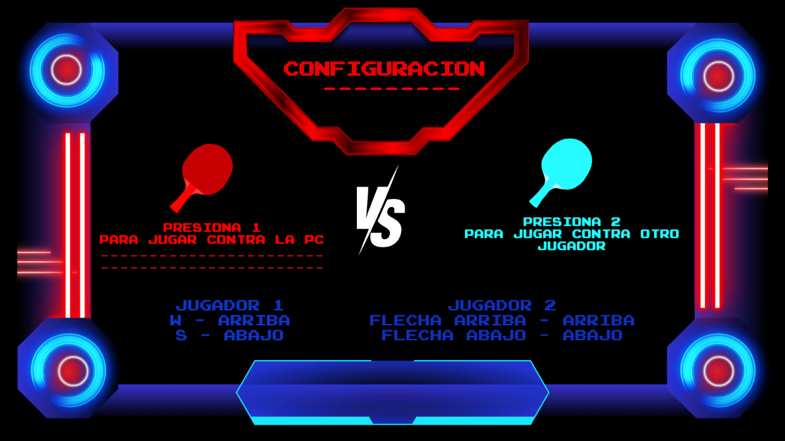
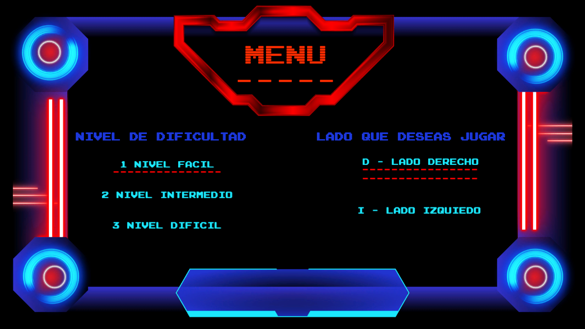
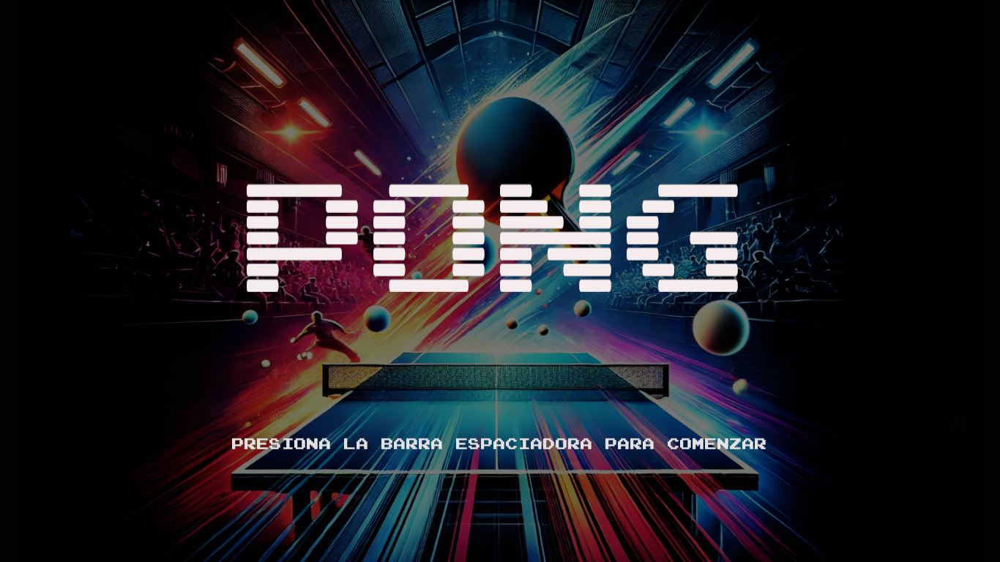
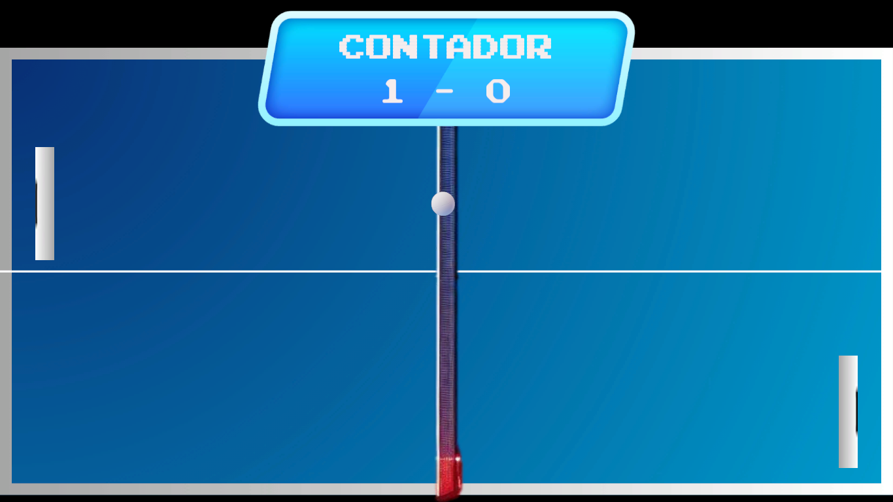

#  Juego de Ping-Pong 🏓

Este proyecto consiste en la creación de un juego interactivo de Ping-Pong (Pong) desarrollado en Unity, el cual ofrece múltiples configuraciones personalizables para mejorar la experiencia del jugador. Está diseñado tanto para juego entre dos personas como contra la computadora, integrando niveles de dificultad, sonidos, mecánicas de velocidad progresiva y reinicio automático.

## Propósito general

El propósito de este proyecto es aplicar conocimientos de desarrollo de videojuegos con Unity para crear una experiencia de juego funcional, dinámica y personalizable.
- Creación de interfaces de usuario (UI) interactivas en Unity.
- Implementación de lógica para múltiples modos de juego.
- Ajuste dinámico de parámetros como dificultad y velocidad.
- Uso de sonido para retroalimentación auditiva.
- Programación de inteligencia artificial básica con adaptación al nivel de dificultad.

## Resultado

El resultado es un videojuego completo de Ping-Pong con las siguientes características:

### Menú principal interactivo
Permite seleccionar:
  - Modo de juego: **Jugador vs Jugador** o **Jugador vs Computadora**.
  - **Nivel de dificultad**: Fácil, Medio, Difícil.
  - **Lado del jugador**: Izquierdo o Derecho.

### Reinicio de partida
Presionando la tecla `ESC`, lo que restablece todas las condiciones del juego correctamente (puntajes, posiciones, velocidad, etc).

### Partida
- **Velocidad progresiva** de la pelota y paletas:
  - Cada vez que uno de los jugadores toca la pelota, la velocidad incrementa ligeramente.
  - La inteligencia artificial también aumenta su velocidad proporcionalmente al número de rebotes y a la dificultad seleccionada.

- **Inteligencia artificial adaptable**:
  - La computadora juega de manera eficaz.
  - Su comportamiento varía según el nivel de dificultad.
  - Su capacidad de reacción y velocidad mejoran durante la partida.

## Colaboradores ✍🏼
El proyecto fue realizado para la materia de *Graficación por Computadora* en la Facultad de Estudios Superiores Aragón durante el semestre **2025-II**.

💻 Ariadna Denisse García Estrada **([ariadna-ge](https://github.com/ariadna-ge))**  
💻 Gustavo Yael Ramos Badillo **([Yae1Ram0s](https://github.com/Yae1Ram0s))**  
